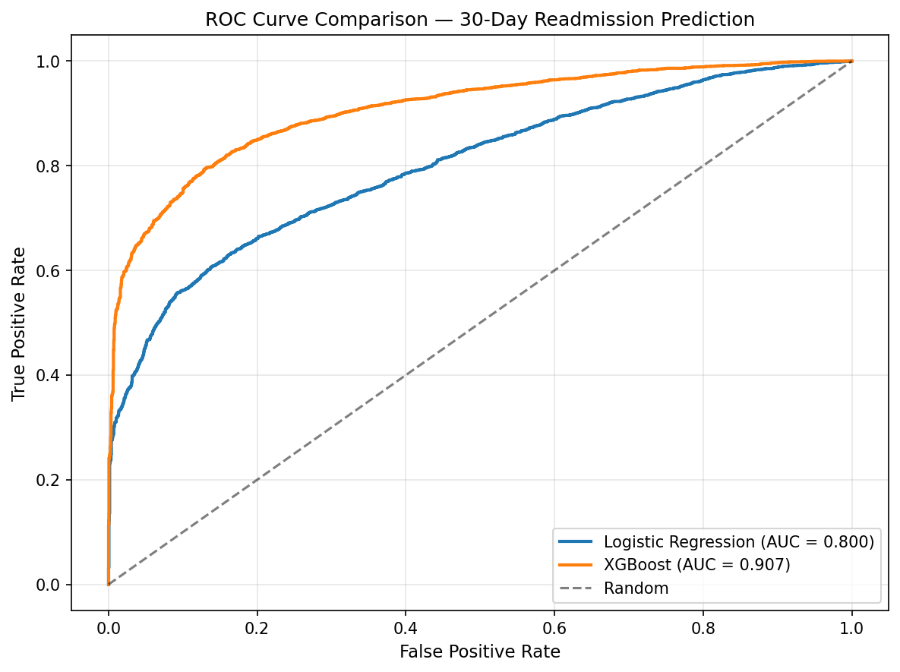
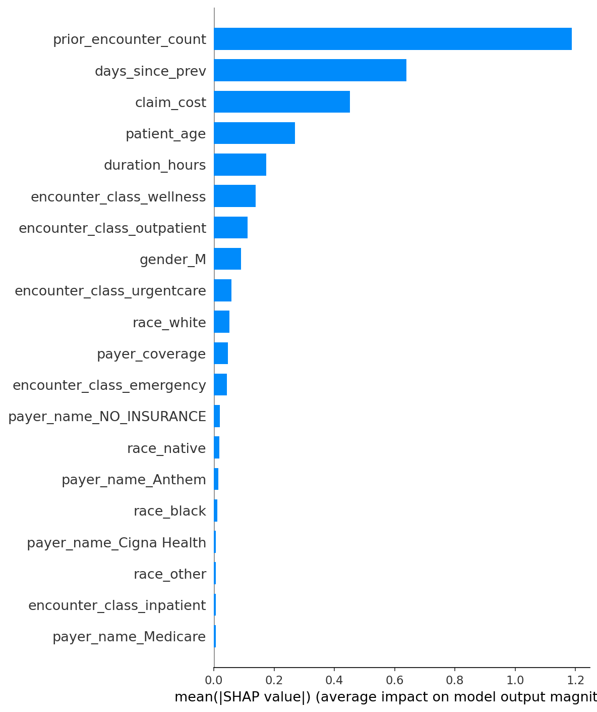
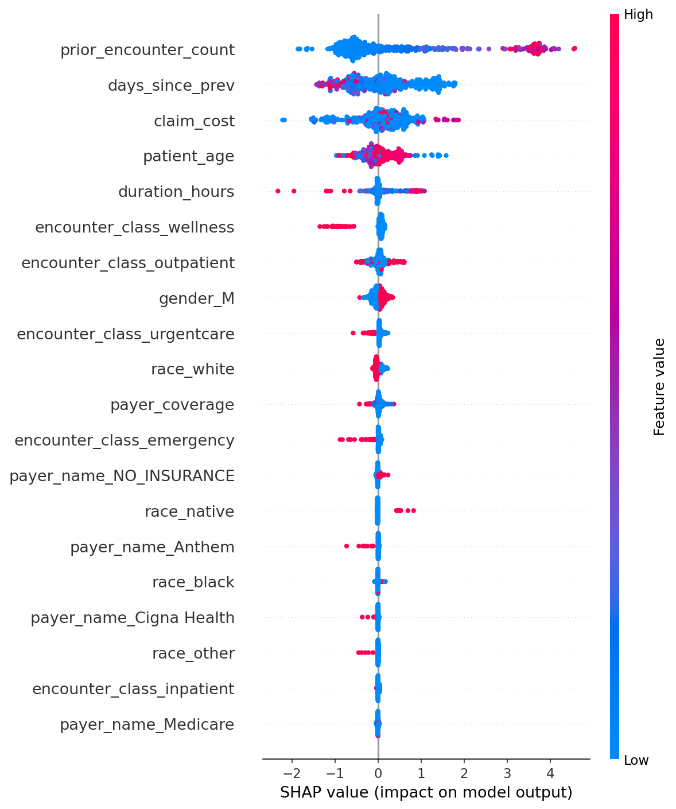

# Hospital Analytics — End-to-End Project

End-to-end hospital analytics on synthetic EHR data: SQL Server data modelling, Power BI dashboards, and Python readmission modelling across 27,891 patient encounters from 974 patients between 2011 and early 2022.

**974 patients • 27,891 encounters • 47,701 procedures • 11 years (2011–2022)**

## Project Status

| Phase | Status | Deliverable |
|---|---|---|
| 1. Data engineering — schema design, BULK INSERT, data quality | ✅ Complete | `sql/01_setup_sqlserver.sql`, `sql/02_data_quality_checks.sql`, `sql/03_data_fixes.sql` |
| 2. SQL analytics — encounters, costs, readmissions | ✅ Complete | `sql/04_analytics_objective1.sql`, `sql/05_analytics_objective2.sql`, `sql/06_analytics_objective3.sql` |
| 3. Power BI dashboard — Operations, Financial, Patient Risk pages | ✅ Complete | `dashboards/hospital_analytics.pbix` |
| 4. Python readmission model — feature engineering, XGBoost, SHAP | ✅ Complete | `notebooks/readmission_model.ipynb` |

## Project Goals

Answer three sets of business questions a hospital operations team would ask:

- **Operations**: encounter volume trends, mix by class, length of stay
- **Financial**: payer coverage gaps, procedure costs, cost variance by payer
- **Patient Risk**: quarterly patient activity, 30-day readmission patterns, predictive risk scoring

## Tech Stack

- **Database**: SQL Server (Microsoft) via SSMS
- **Language**: T-SQL — window functions, CTEs, conditional aggregation
- **Visualisation**: Power BI Desktop with DAX measures
- **Modelling**: Python — Pandas, Scikit-learn, XGBoost, SHAP
- **Database connectivity**: SQLAlchemy + pyodbc (live SQL Server → Python pipeline)
- **Data source**: Synthea synthetic EHR (Walonoski et al., JAMIA 2018)

## Repository Structure

```
hospital-analytics-end-to-end/
├── README.md
├── data_quality_findings.md
├── sql/
│   ├── 01_setup_sqlserver.sql       # Schema and BULK INSERT
│   ├── 02_data_quality_checks.sql   # NULL audit, FK integrity, sanity checks
│   ├── 03_data_fixes.sql            # Empty-string-to-NULL, patient reload
│   ├── 04_analytics_objective1.sql  # Encounters overview
│   ├── 05_analytics_objective2.sql  # Cost and coverage
│   └── 06_analytics_objective3.sql  # Patient behaviour and readmissions
├── dashboards/
│   └── hospital_analytics.pbix      # Power BI dashboard (3 pages)
├── notebooks/
│   ├── readmission_model.ipynb      # ML pipeline with XGBoost and SHAP
│   ├── readmission_model.pkl        # Trained XGBoost model (joblib)
│   └── model_metrics.txt            # AUC and classification report
├── screenshots/                      # Dashboard and model charts
└── docs/
    └── data_dictionary.csv
```

## Dashboard Preview

The Power BI dashboard has three pages.

### Operations Overview
Encounter volume trends, class mix, and duration patterns across 11 years.


### Financial Overview
Payer coverage gaps, cost drivers, and claim variance across encounter types.


### Patient Risk & Readmission
Readmission rates, mortality patterns, and patient risk segmentation.


> 📂 **Open the dashboard**: download [`dashboards/hospital_analytics.pbix`](dashboards/hospital_analytics.pbix) in Power BI Desktop.
>
> *The dashboard is connected to a local SQL Server instance. Cached data is embedded in the file, so all visuals are viewable without a live connection. Refreshing requires the database from `sql/01_setup_sqlserver.sql`.*

## Readmission Prediction Model

A machine learning pipeline predicting whether an encounter will lead to another encounter within 30 days. Implemented in Python with Scikit-learn, XGBoost, and SHAP.

**Approach:**

1. Feature engineering via a single CTE-based SQL query — window functions (`LAG`, `LEAD`, `COUNT OVER`) compute sequential features directly in SQL, avoiding expensive Python loops
2. Two models trained for comparison: Logistic Regression (interpretable baseline) and XGBoost (stronger non-linear model)
3. 80/20 stratified train/test split — 22,312 train / 5,579 test, identical 61.6% / 38.4% target distribution in both
4. SHAP for explainability — which features drove predictions, and how

**Results:**

| Model | AUC |
|---|---|
| Logistic Regression | 0.800 |
| XGBoost | **0.907** |



**Top predictive features (SHAP):**

The model is driven by clinically meaningful features rather than demographic identifiers — exactly what a credible healthcare model should show. Race and gender rank near the bottom of the importance chart.



The beeswarm reveals the *direction* of each feature's effect on individual predictions:

- **High prior encounter count** → strong push toward readmission
- **Recent prior visit (low `days_since_prev`)** → strong push toward readmission
- **Wellness-class encounters** → consistent push *away* from readmission
- **Higher claim costs** → push toward readmission (sicker patients return more)



**Caveats** (also documented in the notebook):

- Synthea synthetic data is cleaner than real EHR — the 0.907 AUC reflects this, not a real-world claim. Production readmission models on real EHR data typically score 0.65–0.75.
- Used the broad readmission definition (any encounter within 30 days). The strict CMS clinical definition (inpatient-to-inpatient) would be a harder, separate modelling problem.
- One chronic-care patient (1,381 ambulatory encounters) heavily influences predictions. A production version would stratify by chronic-care status.

📓 **See the full notebook**: [`notebooks/readmission_model.ipynb`](notebooks/readmission_model.ipynb)

## Data Quality Process

Before any analysis, a full data quality audit was run. Key findings:

- **One patient row failed BULK INSERT** (Mrs. Melaine933 Hintz995) due to special characters. Fixed via SSMS Import Flat File Wizard.
- **All date and string fields loaded as empty strings, not NULLs.** Resolved with `NULLIF()` and `TRY_CAST()`.
- **53 encounters dated after the patient's death date** — flagged as likely admin/billing entries; kept for cost analysis, excluded from patient-level analysis.
- **One chronic-care patient with 1,381 lifetime encounters** — not a data error, documented to prevent misinterpretation in readmission analysis.

Full details in [`data_quality_findings.md`](data_quality_findings.md).

## Key Findings

### Operations

- 27,891 encounters across 11 years, peaking in 2014 (3,885) and 2021 (3,530).
- Ambulatory visits dominate every year (37–60%) except 2021, when outpatient surged to 40% — likely a COVID-era coding shift worth investigating.
- 95.87% of encounters complete within 24 hours; only 4.13% exceed it.

### Financial

- **48.71% of encounters had zero payer coverage** (13,586 of 27,891).
- 4,779 of those zero-coverage encounters belong to *insured* patients — likely deductibles or denied claims, not uninsured.
- Electrical cardioversion is the single biggest cost driver: 1,383 procedures × ~$25,903 ≈ **$35.8M** in base cost.
- Average claim cost varies **3.7×** across payers, from $1,696 (Dual Eligible) to $6,205 (Medicaid). Medicaid and uninsured patients carry the highest average costs — consistent with delayed-care patterns in US healthcare.

### Patient Risk

- Quarterly unique patients stable around 240 most quarters, with surges in 2014-Q1 (394) and 2021-Q1/Q2 (417, 414).
- **79% of patients had at least one encounter within 30 days of a prior one** under a broad definition.
- Under the stricter clinical (inpatient-to-inpatient) definition, only **~29 patients** meet the CMS-standard 30-day readmission criterion. The 26× gap between definitions is itself worth flagging.
- XGBoost model achieves **AUC 0.907** predicting 30-day readmission, with feature importance dominated by clinical history rather than demographics.

## Analytical Notes

Several questions in the brief admit more than one interpretation. Each decision was documented:

| Question | Interpretation used | Alternative reported |
|---|---|---|
| "Zero payer coverage" | `PAYER_COVERAGE = 0` | `PAYER = NO_INSURANCE` |
| "Admitted each quarter" | Any encounter | Inpatient only |
| "Readmitted within 30 days" | Any encounter | Inpatient-to-inpatient |

This explicit framing — both numbers reported, with context — is what separates analysis from query writing.

## How to Reproduce

1. Place CSV files in `C:\HospitalData\` (or update path in `01_setup_sqlserver.sql`).
2. Open SSMS and run scripts in order: `01` → `02` → `03` → `04` → `05` → `06`.
3. Open `dashboards/hospital_analytics.pbix` in Power BI Desktop. Update the SQL Server connection if your instance name differs.
4. Open `notebooks/readmission_model.ipynb` in Jupyter (requires `pandas`, `scikit-learn`, `xgboost`, `shap`, `sqlalchemy`, `pyodbc`). Update the connection string in the first code cell if needed.
5. See `data_quality_findings.md` for context on data quality decisions.

## Data Source

Walonoski J, Kramer M, Nichols J, et al. *Synthea: An approach, method, and software mechanism for generating synthetic patients and the synthetic electronic health care record.* Journal of the American Medical Informatics Association, March 2018. https://doi.org/10.1093/jamia/ocx079
